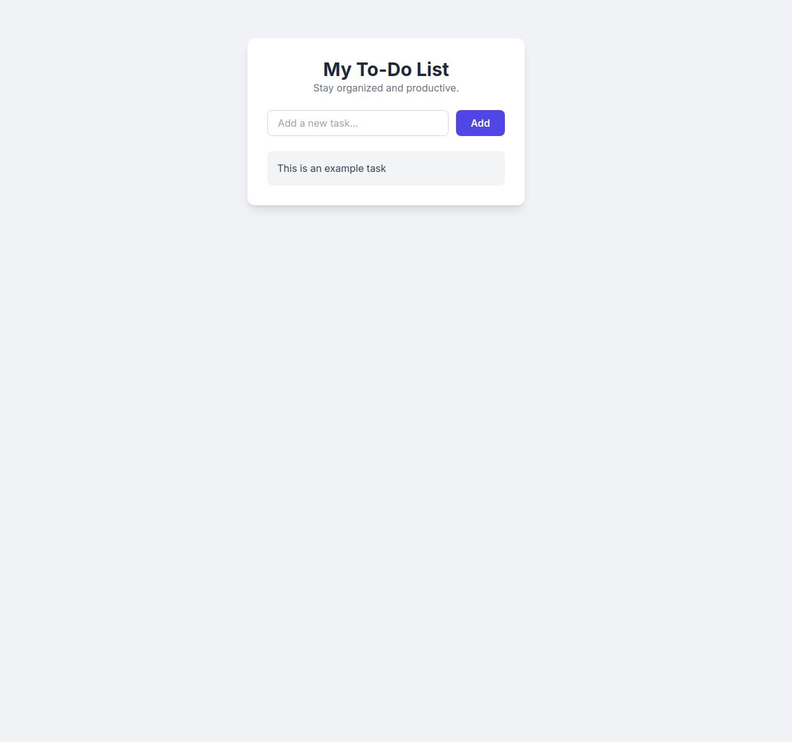

# To-Do List App

This is a simple and modern To-Do List web application built with HTML, CSS (Tailwind CSS), and JavaScript. It helps users stay organized and productive by allowing them to add and delete tasks easily.

## Features

- Add new tasks
- Delete tasks
- Responsive and clean UI
- Example task included for demonstration

## Technologies Used

- HTML5
- Tailwind CSS (via CDN)
- Font Awesome (for icons)
- Google Fonts (Inter)
- JavaScript (script.js)

## Getting Started

1. Clone or download this repository.
2. Open `index.html` in your browser to use the app.

## File Structure

```
CodeSentinel_simpleTodo/
  ├── index.html
  ├── script.js
  ├── style.css
  ├── assests/image.jpg
```

## Usage

- Type a new task in the input field and click "Add" to add it to your list.
- Click the trash icon to delete a task.

## Screenshot



## License

This project is for educational purposes.
